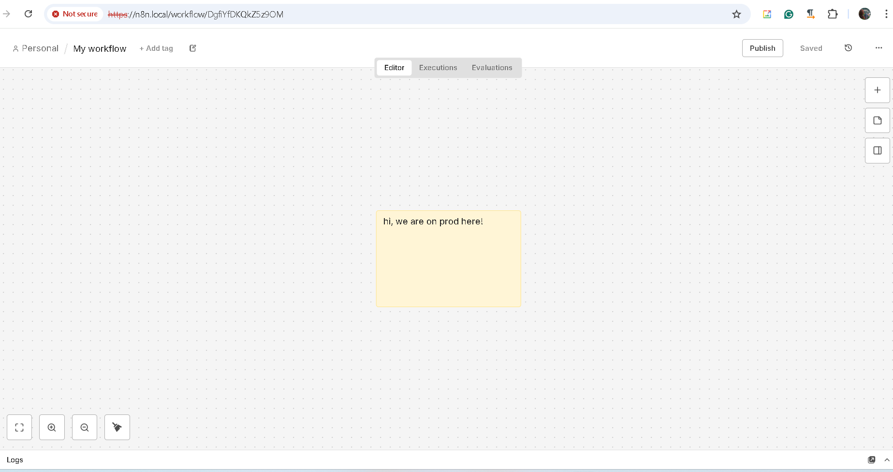
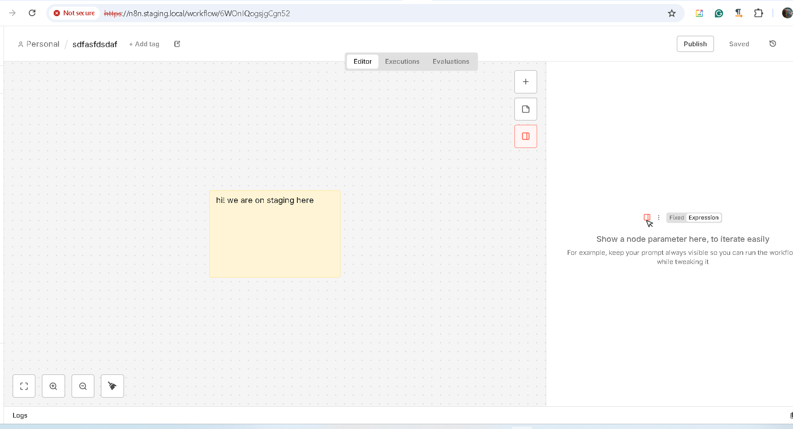

# Курсовий проект Docker&Kubernetes 
1) Застосунок для деплою: 
 n8n - AI Workflow Automation Platform & Tools - 
2) База даних: 
 PostgreSQL (CloudNativePG - PostgreSQL Operator for Kubernetes)


# Результат роботи
### Створено окремий публічний репозиторій з кодом інфраструктури
https://github.com/IUAD1JK7/rd-course-work.git

### Команда flux get helmreleases -A показує, що всі релізи (app, operator) у статусі Ready
Всі релізи (n8n, cloudnative-pg) у статусі Ready
```
C:\olha\rd-course-work>kubectl get helmreleases -A
NAMESPACE     NAME             AGE     READY   STATUS
flux-system   cloudnative-pg   6h10m   True    Helm install succeeded for release flux-system/cloudnative-pg.v1 with chart cloudnative-pg@0.27.0
production    n8n              6h10m   True    Helm upgrade succeeded for release production/n8n.v4 with chart n8n@1.16.8
staging       n8n              6h10m   True    Helm upgrade succeeded for release staging/n8n.v4 with chart n8n@1.16.8
```


### Команда flux get kustomizations -A показує, що оверлеї для обох середовищ синхронізовані
Оверлеї для обох середовищ (staging, production) синхронізовані
```
C:\olha\rd-course-work>flux get kustomizations -A
NAMESPACE  	NAME          	REVISION         	SUSPENDED	READY	MESSAGE                             
flux-system	flux-system   	dev@sha1:f8eb4e71	False    	True 	Applied revision: dev@sha1:f8eb4e71	
flux-system	infrastructure	dev@sha1:f8eb4e71	False    	True 	Applied revision: dev@sha1:f8eb4e71	
flux-system	n8n-production	dev@sha1:f8eb4e71	False    	True 	Applied revision: dev@sha1:f8eb4e71	
flux-system	n8n-staging   	dev@sha1:f8eb4e71	False    	True 	Applied revision: dev@sha1:f8eb4e71	
```

### Налаштований Ingress
```
C:\olha\rd-course-work>kubectl get ingress -A
NAMESPACE    NAME   CLASS     HOSTS               ADDRESS         PORTS     AGE
production   n8n    traefik   n8n.local           192.168.127.2   80, 443   6h11m
staging      n8n    traefik   n8n.staging.local   192.168.127.2   80, 443   6h11m
```

### У кластері існують два неймспейси (для staging та production середовищ) з різною конфігурацією подів (в проді працює HPA)
HPA - HorizontalPodAutoscaler
```
C:\olha\rd-course-work>kubectl get hpa -A
NAMESPACE    NAME      REFERENCE        TARGETS       MINPODS   MAXPODS   REPLICAS   AGE
production   n8n-hpa   Deployment/n8n   cpu: 1%/70%   2         5         2          6h21m
```

Є поди в обох неймспейсах - staging, production 
```
C:\olha\rd-course-work>kubectl get pods -A 
NAMESPACE     NAME                                      READY   STATUS      RESTARTS        AGE
flux-system   cloudnative-pg-746b867b75-mzzwr           1/1     Running     0               6h10m
flux-system   helm-controller-79db8b8d69-87gr5          1/1     Running     0               6h10m
flux-system   kustomize-controller-56f9d9559f-wlxpz     1/1     Running     0               6h10m
flux-system   notification-controller-cb59445f7-knc68   1/1     Running     0               6h10m
flux-system   source-controller-5fd58f7f88-pg928        1/1     Running     0               6h10m
kube-system   coredns-6d668d687-9k52r                   1/1     Running     2 (6h47m ago)   7h26m
kube-system   helm-install-traefik-9w957                0/1     Completed   1               7h26m
kube-system   helm-install-traefik-crd-pflw7            0/1     Completed   0               7h26m
kube-system   local-path-provisioner-869c44bfbd-4pkq6   1/1     Running     2 (6h47m ago)   7h26m
kube-system   metrics-server-7bfffcd44-brx7r            1/1     Running     2 (6h47m ago)   7h26m
kube-system   svclb-traefik-b419d289-ql47f              2/2     Running     4 (6h47m ago)   7h26m
kube-system   traefik-865bd56545-vw5ws                  1/1     Running     2 (6h47m ago)   7h26m
production    n8n-c8f7789ff-7hxxk                       1/1     Running     0               3h21m
production    n8n-c8f7789ff-wd62c                       1/1     Running     0               3h20m
production    postgres-db-1                             1/1     Running     0               5h17m
production    postgres-db-2                             1/1     Running     0               5h17m
production    postgres-db-3                             1/1     Running     0               5h17m
staging       n8n-7c4fc76dc5-59hsb                      1/1     Running     5 (3h19m ago)   3h21m
staging       postgres-db-1                             1/1     Running     0               5h17m
```


### Застосунок успішно підключається до бази даних, створеної оператором
Вікно застосунку у середовищі production


Вікно застосунку у середовищі staging


### Self-Healing
Після kubectl delete helmrelease n8n -n production поди застосунку n8n відновлюются протягом декількох хвилин:
```
C:\olha\rd-course-work>kubectl get pods -n production
NAME                  READY   STATUS    RESTARTS   AGE
n8n-c8f7789ff-4zgdp   1/1     Running   0          2m47s
n8n-c8f7789ff-vs6xz   1/1     Running   0          2m47s
postgres-db-1         1/1     Running   0          6h25m
postgres-db-2         1/1     Running   0          6h25m
postgres-db-3         1/1     Running   0          6h24m
```

